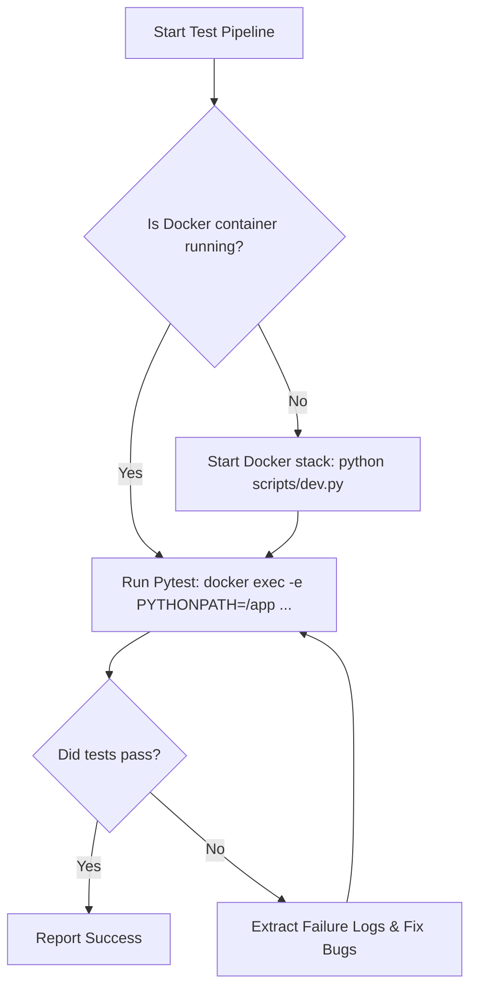

# Pytest Docker Skill

## Overview

The Whiskers Agent MCP server operates in a containerized environment. To ensure dependencies (like PostgreSQL, `pgvector`, and FastMCP packages) are fully aligned and identical to the deployment target, all automated test runs should execute inside the running Docker container (`whiskers-agent-server`) instead of on the host's `.venv` or environment.

This skill outlines the commands, configurations, and best practices for auto-running and troubleshooting the pytest pipeline inside the Docker environment.

---

## Core Execution Pattern

When running tests, you must execute them inside the `whiskers-agent-server` Docker container with the `PYTHONPATH` environment variable set to `/app`.

### 1. Run the Entire Test Suite
```bash
docker exec -e PYTHONPATH=/app whiskers-agent-server pytest
```

### 2. Run Specific Test Files
To run only unit tests or integration tests, or to run a single test module:
```bash
# Run all unit tests
docker exec -e PYTHONPATH=/app whiskers-agent-server pytest test/unit/

# Run a specific unit test file
docker exec -e PYTHONPATH=/app whiskers-agent-server pytest test/unit/test_plugin_loader.py

# Run a specific unit test and integration test together
docker exec -e PYTHONPATH=/app whiskers-agent-server pytest test/unit/test_plugin_loader.py test/unit/test_rate_limiter.py
```

### 3. Run Specific Test Cases
To target specific test classes or test functions, use the standard pytest double-colon (`::`) syntax:
```bash
docker exec -e PYTHONPATH=/app whiskers-agent-server pytest test/unit/test_plugin_loader.py::test_toposort_linear_chain
```

---

## Pipeline Integration & Automation

For AI agents and automated scripts, the following workflow is recommended to auto-run the test pipeline and capture results.



### Scripted Automation Example (Python)
An agent or automation script can invoke the pipeline programmatically using Python's `subprocess` module:

```python
import subprocess
import sys

def run_tests():
    # Verify container is running
    container = "whiskers-agent-server"
    check_cmd = ["docker", "ps", "--filter", f"name={container}", "--format", "{{.Names}}"]
    result = subprocess.run(check_cmd, capture_output=True, text=True, check=True)
    if container not in result.stdout:
        print(f"Error: {container} is not running. Launch it using 'python scripts/dev.py' first.")
        sys.exit(1)
        
    # Execute the test pipeline
    print("🚀 Running test pipeline in Docker container...")
    test_cmd = ["docker", "exec", "-e", "PYTHONPATH=/app", container, "pytest"]
    test_result = subprocess.run(test_cmd)
    
    if test_result.returncode == 0:
        print("✅ All tests passed successfully!")
    else:
        print(f"❌ Test suite failed with exit code {test_result.returncode}")
        sys.exit(test_result.returncode)

if __name__ == "__main__":
    run_tests()
```

---

## Common Gotchas & Troubleshooting

### 1. Missing `PYTHONPATH`
If you run `docker exec whiskers-agent-server pytest` without `-e PYTHONPATH=/app`, Python will fail to find root-level packages like `api`, `plugin_loader`, `db_layer`, and `utils`, raising `ModuleNotFoundError`.
* **Fix**: Always specify `-e PYTHONPATH=/app` in your `docker exec` command.

### 2. Database Connection Issues
If database-dependent integration tests fail (such as pgvector, embedding calculations, or plugin DB operations):
* **Cause**: The container cannot connect to the database or migrations are not up-to-date.
* **Fix**: Make sure migrations are run on the database inside the container:
  ```bash
  python scripts/migrate.py upgrade head
  ```
  And reseed if necessary:
  ```bash
  python scripts/reseed.py --full
  ```

### 3. Rate-Limiting & Expired Monotonic Time Mocking
The in-memory rate-limiter in `api/admin_routes.py` uses `time.monotonic()`. 
* **Cause**: Tests mocking time using `time.time()` (epoch time) instead of `time.monotonic()` will fail to prune attempts correctly, causing blockages.
* **Fix**: When mocking or defining lockout times, always align with `time.monotonic()` and use the correct lockout scale (60s lockout for rate limiter limits).
